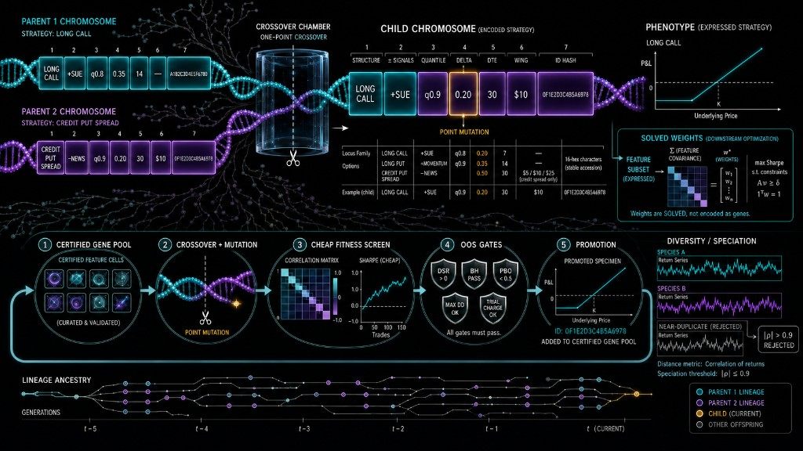

# options-tournament

Paper-traded US equity options on Alpaca. The agent sizes and submits defined-risk structures — long calls, long puts, and credit put spreads — against a dedicated paper account.

Use it to run a tournament book: read the chain, pick a contract by delta and days-to-expiry, cap loss in Python, and send limit orders to the paper host. Nothing here routes to live trading.

## Install

Python 3.11+.

```bash
python -m venv .venv
source .venv/bin/activate
pip install -e ".[dev]"
cp .env.example .env
```

Fill `.env` with an Alpaca **paper** keypair. Add `FEATHERLESS_API_KEY` to run the specialist roster. Keep `OPTIONS_PAPER_ARMED=0` until you intend to submit.

## Commands

```bash
options-tournament account
options-tournament chain AAPL
options-tournament propose -n 3 --universe AAPL,MSFT,NVDA
options-tournament execute card.json --dry-run
options-tournament execute card.json --arm
options-tournament serve
options-tournament mcp
```

`serve` binds `127.0.0.1:8899`. `mcp` speaks stdio for MCP clients. If the Alpaca CLI is on PATH it is used for account identity; orders still go through the Trading API.

## Strategy card

```json
{
  "underlying": "AAPL",
  "structure": "long_call",
  "dte": 7,
  "delta": 0.55
}
```

`credit_put_spread` also accepts `wing_width` (strike dollars). Selection, sizing, and max-loss stay in Python.

## Gene selection

Each strategy is a chromosome of seven loci: structure, signed signals, quantile, delta, days to expiry, wing width, and a stable ID. Parents combine by one-point crossover; a point mutation can flip a single locus. Feature weights are solved downstream to maximize Sharpe under constraints — they are not encoded as genes.

New children go through a cheap fitness screen, then out-of-sample gates (deflated Sharpe, Bailey–López de Prado, probability of backtest overfitting, drawdown and trial charge). Only specimens that pass every gate are promoted into the certified pool. Return series with absolute correlation above 0.9 are rejected as near-duplicates.



## Featherless agents

A bounded specialist roster on Featherless proposes the cards that compete in the tournament. Hypothesis (OpenMath-Nemotron-32B) picks complementary underlyings and theses. Strategist (DeepSeek-V3) maps each thesis onto structure, delta, and DTE. Proposer (Qwen3-32B) inspects the book with read-only tools and submits typed cards. Critic (DeepSeek-V3) flags near-duplicates and venue violations — flags only, never a risk number.

Python still owns selection, sizing, and max-loss. Models never emit premium or payoff. `propose` prints cards; execute them the same way as a hand-written card.

Set `FEATHERLESS_API_KEY` in `.env`. Chat uses Featherless when that key is present.

## Safety

- The trading client refuses any host that is not `paper-api.alpaca.markets`
- Submits require `OPTIONS_PAPER_ARMED=1` and `--arm`
- A credit spread with an uncovered short leg is refused
- Keys live in `.env`, which is gitignored

## License

MIT. See [LICENSE](LICENSE) and [NOTICE](NOTICE).
